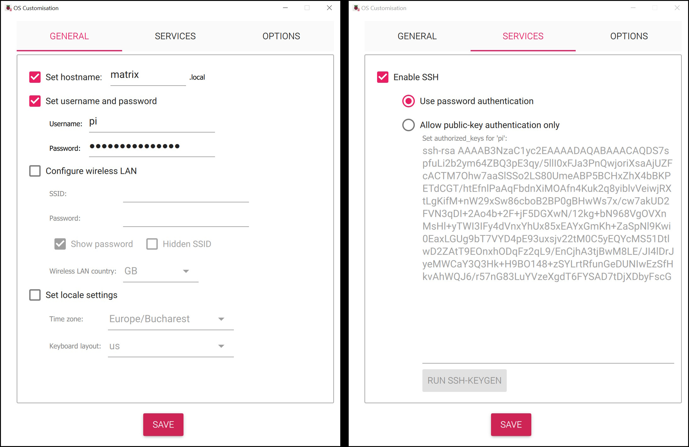

A fun and educational DIY project to build with your kid! This guide covers creating a RGB 32x32 LED Matrix using 3D printing, a Raspberry Pi, `Node-RED`, `rpi-rgb-led-matrix` library and `Adafruit PixelDust` project. Sure, you could buy a ready-made solution—but where’s the fun in that when you can build it yourself? 😊

<!-- truncate -->

## Introduction

My first project built together with my kids (kind of) is a 32x32 LED Matrix. I chose this project because I get a nostalgia emotion about my childhood when I played a lot of 8-bit games when Pixel art was the norm, and I think my kids are visually rewarded when they see pixels flickering.
In building this project, I used all my engineering design skills to build a box for the hardware and all my development and home automation experience to assemble the software for it.

## Components & Tools

| No | Component                | Description                                   | Quantity |
|----|--------------------------|-----------------------------------------------|----------|
| 1  | Raspberry Pi up to 4 supported:<br/>- [Raspberry Pi 3](https://amzn.to/41xCfEt)<br/> - [Raspberry Pi 3 A+](https://amzn.to/41Uyc54)<br/>- [Raspberry Pi 4](https://amzn.to/41xBWJP) | Microcomputer to control the LED matrix      | 1        |
| 2  | 32x32 RGB LED Matrix     | LED panel for display                        | 1        |
| 3  | [Adafruit RGB Matrix HAT](https://www.adafruit.com/product/2345)  | Simplifies connections between Pi and matrix | 1        |
| 4  | Power Supply ([5V 5A](https://amzn.to/3FIYgIT), [5V 6A](https://amzn.to/429oBsk) or [higher](https://amzn.to/3XR1bFC)) | Powers the LED matrix and Raspberry Pi | 1        |
| 5  | [Jumper Wires](https://amzn.to/4h8ABPn) (Male-Male, Male-Female) | For connecting components        | Several  |
| 6  | MicroSD Card (16GB or higher):<br/> - [SAMSUNG PRO Endurance 32GB](https://amzn.to/3FHaBgI)<br/> - [SanDisk 32GB High Endurance](https://amzn.to/426mhSW) | Stores the Raspberry Pi OS and software  | 1        |
| 7  | [Heat Sink](https://amzn.to/4iwKveZ) | Prevents Raspberry Pi from overheating       | Optional |

## Assembly & Wiring

## Software Setup

### Raspberry OS

The first step is to install an operating system on the Raspberry Pi. My preferred method is using Raspberry Pi Imager, which simplifies the process.  
You can download the installer from the official [Raspberry Pi software page](https://www.raspberrypi.com/software/).  

:::info[Note on Installation]

I won't cover the full process of installing Raspberry Pi OS on a microSD card here, as the official [Raspberry Pi documentation](https://www.raspberrypi.com/documentation/computers/getting-started.html#raspberry-pi-imager) provides an excellent step-by-step guide.  

:::

As operating system we will chose  Raspbian Lite (64bit) because is bit easier to get started with and is a good second choice as [rpi-rgb-led-matrix](https://github.com/hzeller/rpi-rgb-led-matrix?tab=readme-ov-file#raspberry-pi-up-to-4-supported) library states.

Additionally, you’ll need a card reader to write the OS. If you don’t have one, you might consider the [BENFEI Memory Card Reader](https://amzn.to/4huCLZR) on Amazon.  

We also need to customize the installation by setting the *hostname* to `matrix.local`, configuring the *username* and *password* in the **GENERAL** tab, and `Enable SSH` in the **SERVICE** tab.

It’s also optional but recommended to set up a **wireless LAN** connection during installation, or you can simply use a **LAN cable** to connect your Raspberry Pi to the router.  

  

### Connecting via SSH

Once the Raspberry Pi is powered on and connected to the network, we need to check if we can access it via SSH. If you're new to SSH, you can follow this great guide:  
[How To Use SSH to Connect to a Remote Server (Windows, Linux & Mac)](https://www.strongdm.com/blog/how-to-use-ssh-to-connect-to-remote-server-windows-linux-mac).  

To connect, use the following command in your terminal:  

```bash
ssh pi@matrix.local
```

Enter the password you set during installation when prompted.

For more details on SSH and Raspberry Pi, check the official documentation:
[Connect to an SSH Server](https://www.raspberrypi.com/documentation/computers/remote-access.html#connect-to-an-ssh-server).

### Updating the Operating System

Now that we have access, it's time to update the OS to ensure we have the latest software and security updates. Run the following commands:

```bash
sudo apt update
sudo apt full-upgrade -y
```

For more information on updating Raspberry Pi OS, visit the official guide:  
[Update Raspberry Pi OS](https://www.raspberrypi.com/documentation/computers/os.html#update-software).

Once the update is complete, we can move on to installing the necessary libraries to bootstrap our RGB LED matrix.

### Disable the Built-in Sound Card of Raspberry Pi

When using the [rpi-rgb-led-matrix](https://github.com/hzeller/rpi-rgb-led-matrix) library, the built-in sound module can cause compatibility nightmares. By silencing this pesky module, you'll ensure your 32x32 LED matrix runs smoother than a jazz performance! 🎵

Open the blacklist configuration:

```bash
sudo nano /etc/modprobe.d/raspi-blacklist.conf
```

Add this magical line to banish sound:

```text
blacklist snd_bcm2835
```

Update and reboot:

```bash
sudo update-initramfs -u
sudo reboot
```

After rebooting, confirm the sound module is gone:

```bash
lsmod | grep snd_bcm2835
```

If there's no output, the sound module is disabled. Perfect!

### Installing rpi-rgb-led-matrix library

The `rpi-rgb-led-matrix` library allows you to control RGB LED matrix panels using a Raspberry Pi.

Before cloning the repository, install the necessary packages:

```sh
sudo apt install -y git build-essential libgraphicsmagick++-dev libwebp-dev libjpeg-dev python3-pillow python3-numpy python3-pip
```

Ensure you are in the /home/pi directory before cloning:

```sh
cd /home/pi
```

Clone the rpi-rgb-led-matrix repository from GitHub:

```sh
git clone https://github.com/hzeller/rpi-rgb-led-matrix.git
cd rpi-rgb-led-matrix
```

```sh
make -C examples-api-use
make -C utils
sudo examples-api-use/demo -D0 --led-gpio-mapping=adafruit-hat-pwm
```

You should see a colorful rotating square, along with color transitions, geometric shapes, and wavy patterns, demonstrating the LED matrix's capabilities. 🚀🌈

Press `<CTRL-C>` to exit and reset LEDs.

For more details, visit the official GitHub repository:
[rpi-rgb-led-matrix](https://github.com/hzeller/rpi-rgb-led-matrix?tab=readme-ov-file#lets-do-it)

### Getting the animations

Over the years, I have come across several great sources for animated GIF files that can be used for LED matrix displays. Here are some of the best places to find them:

- [PIXEL on Github](https://github.com/alinke/PIXEL/tree/master/pixel-pc/src/main/resources/animations/gifsource)
- [Ledpixelart](https://ledpixelart.com/art/)
- [marcmerlin on Github](https://github.com/marcmerlin/AnimatedGIFs/tree/master/gifs/gifs32)
- [animated-gif-collection](https://community.pixelmatix.com/t/animated-gif-collection/26)
- [poemusica on Github](https://github.com/poemusica/rpi-matrix-gif)
- [Super Mario Kart](https://www.snesmaps.com/maps/SuperMarioKart/sprites/SuperMarioKartSprites.html)

#### Downloading and Organizing GIFs

For this tutorial, we will download a collection of GIFs from [Ledpixelart](ledpixelart.com/art/)  and organize them for easy access. To do this, run the following command to download and extract the images:

```bash
wget https://ledpixelart.com/wp-content/uploads/2017/09/pixel-all-art.zip && unzip pixel-all-art.zip -d /home/pi/gifs && rm pixel-all-art.zip
```

To verify that the images have been downloaded and renamed correctly, you can use the following command to display one of the GIFs on the LED matrix. The animation should show a steam train moving across the screen:

```bash
sudo /home/pi/rpi-rgb-led-matrix/utils/led-image-viewer -f -s --led-gpio-mapping=adafruit-hat-pwm --led-cols=32 --led-rows=32 --led-brightness=45 /home/pi/gifs/ITEM0050.GIF
```

To streamline the process of generating the animation data stream, first remove the corrupted images (62, 63, and __MACOSX folder):

```bash
rm -rf /home/pi/gifs/ITEM0062.GIF /home/pi/gifs/ITEM0063.GIF /home/pi/gifs/__MACOSX/
```

Next, to make it easier to change animations from the command line, we will rename all the GIF files sequentially:

```bash
cd /home/pi/gifs/
ls -v | cat -n | while read n f; do mv -n "$f" "$n.gif"; done
```

This is necessary because, in Node-RED, we want to parameterize the command that changes the animation:

```bash
/home/pi/gifs/${random}.gif
```

#### Converting GIFs to Stream

To generate the animation stream, first convert the GIF files into the stream format. Run the following command to process the GIFs and create the stream file. The conversion time will vary depending on the number of images in the GIF folder—in our case, there are approximately 100 GIFs:

```bash
cd /home/pi
sudo /home/pi/rpi-rgb-led-matrix/utils/led-image-viewer --led-gpio-mapping=adafruit-hat-pwm --led-cols=32 --led-rows=32 --led-brightness=45 -w0.016667 /home/pi/gifs/*.gif -Oanimation-out.stream
```

Once the conversion is complete, you can display the resulting animation using the following command:

```bash
sudo /home/pi/rpi-rgb-led-matrix/utils/led-image-viewer --led-rows=32 --led-gpio-mapping=adafruit-hat-pwm --led-cols=32 --led-rows=32 --led-brightness=45 /home/pi/animation-out.stream
```

If something appears on your screen, that’s a great sign! We can now proceed with installing Adafruit PixelDust library.

#### Installing Adafruit PixelDust library

#### Enabling I2C for Adafruit PixelDust

To read the accelerometer and use Adafruit PixelDust, I2C must be enabled via the raspi-config interface. Follow Adafruit’s guide to [enable I2C on Raspberry Pi](https://learn.adafruit.com/adafruits-raspberry-pi-lesson-4-gpio-setup/configuring-i2c). If you're already familiar with the process, simply run sudo raspi-config, navigate to Interfacing Options, and enable I2C.

##### Download Adafruit PixelDust library

Download the Adafruit PixelDust library from GitHub:

```bash
git clone https://github.com/adafruit/Adafruit_PixelDust.git
```

To compile the library, navigate to the `raspberry` folder and run the build command:

```bash
cd Adafruit_PixelDust/raspberry_pi
make
```

After compiling the Adafruit PixelDust library, you can test it to ensure everything is working correctly:

```bash
sudo /home/pi/Adafruit_PixelDust/raspberry_pi/demo2-hourglass -f -s --led-gpio-mapping=adafruit-hat-pwm --led-cols=32 --led-rows=32 --led-brightness=45
```

### Installing Node-RED on Raspberry Pi

Node-RED is a powerful flow-based development tool for visual programming, especially useful for IoT projects and Raspberry Pi enthusiasts.

#### Run the official Node-RED installation script

This script installs Node.js (if needed), Node-RED, and sets up the system to run it as a service:

```bash
bash <(curl -sL https://raw.githubusercontent.com/node-red/linux-installers/master/deb/update-nodejs-and-nodered)
```

The script will:

- Remove old versions of Node-RED and Node.js
- Install the recommended version of Node.js
- Install the latest version of Node-RED
- Install and configure it to run as a systemd service (autostart on boot)

> **Note**: The script will ask for confirmation before proceeding with the installation. Press `Y` when prompted.

For more detailed information, you can visit the official [Node-RED Raspberry Pi documentation](https://nodered.org/docs/getting-started/raspberrypi).

#### Start Node-RED

Once installed, you can start Node-RED with:

```bash
node-red-start
```

To stop it:

```bash
node-red-stop
```

To enable Node-RED to start automatically on boot:

```bash
sudo systemctl enable nodered.service
```

#### Importing the Flow

Once Node-RED is installed and running on your Raspberry Pi, you can easily import a ready-made flow to handle the button interactions and control the LED matrix.

Open a browser and go to:

```
http://matrix.local:1880
```

1. In the Node-RED editor, click the ☰ menu (top right).
2. Choose **Import** → **Clipboard**.
3. Paste the JSON content from the section below into the text box.
4. Click **Import**.
5. You should now see a new flow with all nodes configured.

<details>
<summary>Click to expand the flow JSON</summary>
```JSON
[
    {
        "id": "ccc8162785086225",
        "type": "tab",
        "label": "Matrix",
        "disabled": false,
        "info": "",
        "env": []
    },
    {
        "id": "172662426c12056d",
        "type": "junction",
        "z": "ccc8162785086225",
        "x": 1180,
        "y": 300,
        "wires": [
            [
                "0e2692001c26668a",
                "eeb8fd5b059d76ac",
                "21eb562374ce29d2"
            ]
        ]
    },
    {
        "id": "66cf1ccda1be38b2",
        "type": "button-events-config",
        "name": "Button config",
        "clickedInterval": "500",
        "pressedInterval": "4750",
        "debounceInterval": "15"
    },
    {
        "id": "9c11b3eb84ce35ae",
        "type": "comment",
        "z": "ccc8162785086225",
        "name": "LED MATRIX",
        "info": "",
        "x": 150,
        "y": 60,
        "wires": []
    },
    {
        "id": "21eb562374ce29d2",
        "type": "exec",
        "z": "ccc8162785086225",
        "command": "sudo pkill -9 -f \"rpi-rgb-led-matrix\" & sudo pkill -9 -f \"Adafruit_PixelDust\"",
        "addpay": "",
        "append": "",
        "useSpawn": "false",
        "timer": "",
        "winHide": false,
        "oldrc": false,
        "name": "Stop",
        "x": 1330,
        "y": 380,
        "wires": [
            [],
            [],
            []
        ]
    },
    {
        "id": "eeb8fd5b059d76ac",
        "type": "delay",
        "z": "ccc8162785086225",
        "name": "",
        "pauseType": "delay",
        "timeout": "300",
        "timeoutUnits": "milliseconds",
        "rate": "1",
        "nbRateUnits": "1",
        "rateUnits": "second",
        "randomFirst": "1",
        "randomLast": "5",
        "randomUnits": "seconds",
        "drop": false,
        "allowrate": false,
        "outputs": 1,
        "x": 1350,
        "y": 300,
        "wires": [
            [
                "20c72af576652480"
            ]
        ]
    },
    {
        "id": "20c72af576652480",
        "type": "exec",
        "z": "ccc8162785086225",
        "command": "",
        "addpay": "payload",
        "append": "",
        "useSpawn": "false",
        "timer": "",
        "winHide": false,
        "oldrc": false,
        "name": "Execute",
        "x": 1520,
        "y": 300,
        "wires": [
            [],
            [],
            []
        ]
    },
    {
        "id": "8c851b8c0b424bd9",
        "type": "rpi-gpio in",
        "z": "ccc8162785086225",
        "name": "Button",
        "pin": "25",
        "intype": "up",
        "debounce": "25",
        "read": false,
        "bcm": true,
        "x": 130,
        "y": 340,
        "wires": [
            [
                "299ea27f23024223"
            ]
        ]
    },
    {
        "id": "c05b30b718309907",
        "type": "exec",
        "z": "ccc8162785086225",
        "command": "sudo shutdown -h now",
        "addpay": "",
        "append": "",
        "useSpawn": "false",
        "timer": "",
        "winHide": false,
        "oldrc": false,
        "name": "Shut Down",
        "x": 470,
        "y": 620,
        "wires": [
            [],
            [],
            []
        ]
    },
    {
        "id": "299ea27f23024223",
        "type": "button-events",
        "z": "ccc8162785086225",
        "name": "",
        "outputs": 7,
        "inputField": "payload",
        "inputFieldType": "msg",
        "outputField": "payload",
        "outputFieldType": "msg",
        "downValue": "0",
        "downValueType": "num",
        "upValue": "1",
        "upValueType": "num",
        "idleValue": "1",
        "buttonEventsConfig": "66cf1ccda1be38b2",
        "clickedInterval": null,
        "pressedInterval": null,
        "debounceInterval": null,
        "events": [
            {
                "type": "clicked"
            },
            {
                "type": "double_clicked"
            },
            {
                "type": "triple_clicked"
            },
            {
                "type": "quadruple_clicked"
            },
            {
                "type": "pressed"
            },
            {
                "type": "clicked_pressed"
            },
            {
                "type": "double_clicked_pressed"
            }
        ],
        "x": 280,
        "y": 340,
        "wires": [
            [
                "8f1bad193f6e7bca"
            ],
            [
                "d3f342e79b2bec5c"
            ],
            [
                "5dfa112047b18bae"
            ],
            [
                "a00680d2ae5b45bf"
            ],
            [
                "85eb2def53662ca0"
            ],
            [
                "c05b30b718309907"
            ],
            [
                "d64274ec0316ebe3"
            ]
        ]
    },
    {
        "id": "bbb94f4124bc3f18",
        "type": "inject",
        "z": "ccc8162785086225",
        "name": "Run GIF on startup",
        "props": [
            {
                "p": "payload"
            }
        ],
        "repeat": "",
        "crontab": "",
        "once": true,
        "onceDelay": "1",
        "topic": "",
        "payload": "",
        "payloadType": "date",
        "x": 270,
        "y": 100,
        "wires": [
            [
                "8f1bad193f6e7bca"
            ]
        ]
    },
    {
        "id": "5dfa112047b18bae",
        "type": "change",
        "z": "ccc8162785086225",
        "name": "All GIFs",
        "rules": [
            {
                "t": "set",
                "p": "payload",
                "pt": "msg",
                "to": "sudo /home/pi/rpi-rgb-led-matrix/utils/led-image-viewer --led-gpio-mapping=adafruit-hat-pwm --led-cols=32 --led-rows=32 --led-brightness=45 /home/pi/animation-out.stream",
                "tot": "str"
            }
        ],
        "action": "",
        "property": "",
        "from": "",
        "to": "",
        "reg": false,
        "x": 480,
        "y": 320,
        "wires": [
            [
                "172662426c12056d"
            ]
        ]
    },
    {
        "id": "d64274ec0316ebe3",
        "type": "change",
        "z": "ccc8162785086225",
        "name": "Text hello",
        "rules": [
            {
                "t": "set",
                "p": "payload",
                "pt": "msg",
                "to": "sudo /home/pi/rpi-rgb-led-matrix/utils/text-scroller -f /home/pi/rpi-rgb-led-matrix/fonts/10x20.bdf --led-gpio-mapping=adafruit-hat-pwm --led-cols=32 --led-rows=32 --led-brightness=45 -s3 -O0,0,100 -C255,0,0 -y5 \"Hi Damian! ♥ ☺ ☼\"",
                "tot": "str"
            }
        ],
        "action": "",
        "property": "",
        "from": "",
        "to": "",
        "reg": false,
        "x": 480,
        "y": 440,
        "wires": [
            [
                "172662426c12056d"
            ]
        ]
    },
    {
        "id": "8f1bad193f6e7bca",
        "type": "function",
        "z": "ccc8162785086225",
        "name": "One Random GIF",
        "func": "// Function to generate a random integer between min and max (inclusive)\nfunction randomIntFromInterval(min, max) {\n    return Math.floor(Math.random() * (max - min + 1) + min);\n}\n\n// Generate a random number between 1 and 278\nconst random = randomIntFromInterval(1, 278);\n\n// Construct the command to display a random GIF on the LED matrix\n// - Uses the sudo command to run as superuser\n// - Specifies the LED matrix settings (GPIO mapping, dimensions, brightness)\n// - Selects a random GIF from the \"/home/pi/gifs/\" directory\nmsg.payload = `sudo /home/pi/rpi-rgb-led-matrix/utils/led-image-viewer -f -s --led-gpio-mapping=adafruit-hat-pwm --led-cols=32 --led-rows=32 --led-brightness=45 /home/pi/gifs/${random}.gif`;\n\n// Return the modified msg object for the next node in Node-RED\nreturn msg;",
        "outputs": 1,
        "noerr": 0,
        "initialize": "",
        "finalize": "",
        "libs": [],
        "x": 510,
        "y": 100,
        "wires": [
            [
                "172662426c12056d"
            ]
        ]
    },
    {
        "id": "360a0220d21c9c6d",
        "type": "rpi-gpio out",
        "z": "ccc8162785086225",
        "name": "",
        "pin": "14",
        "set": "",
        "level": "0",
        "freq": "",
        "out": "out",
        "bcm": true,
        "x": 1510,
        "y": 220,
        "wires": []
    },
    {
        "id": "0e2692001c26668a",
        "type": "trigger",
        "z": "ccc8162785086225",
        "name": "",
        "op1": "0",
        "op2": "1",
        "op1type": "str",
        "op2type": "str",
        "duration": "300",
        "extend": false,
        "overrideDelay": false,
        "units": "ms",
        "reset": "",
        "bytopic": "all",
        "topic": "topic",
        "outputs": 1,
        "x": 1360,
        "y": 220,
        "wires": [
            [
                "360a0220d21c9c6d"
            ]
        ]
    },
    {
        "id": "a00680d2ae5b45bf",
        "type": "change",
        "z": "ccc8162785086225",
        "name": "Rocket",
        "rules": [
            {
                "t": "set",
                "p": "payload",
                "pt": "msg",
                "to": "sudo /home/pi/rpi-rgb-led-matrix/utils/led-image-viewer -f -s --led-gpio-mapping=adafruit-hat-pwm --led-cols=32 --led-rows=32 --led-brightness=45 /home/pi/gifs/114.gif",
                "tot": "str"
            }
        ],
        "action": "",
        "property": "",
        "from": "",
        "to": "",
        "reg": false,
        "x": 480,
        "y": 360,
        "wires": [
            [
                "172662426c12056d"
            ]
        ]
    },
    {
        "id": "85eb2def53662ca0",
        "type": "change",
        "z": "ccc8162785086225",
        "name": "Bubbles",
        "rules": [
            {
                "t": "set",
                "p": "payload",
                "pt": "msg",
                "to": "sudo /home/pi/rpi-rgb-led-matrix/utils/led-image-viewer -f -s --led-gpio-mapping=adafruit-hat-pwm --led-cols=32 --led-rows=32 --led-brightness=45 /home/pi/gifs/79.gif",
                "tot": "str"
            }
        ],
        "action": "",
        "property": "",
        "from": "",
        "to": "",
        "reg": false,
        "x": 480,
        "y": 400,
        "wires": [
            [
                "172662426c12056d"
            ]
        ]
    },
    {
        "id": "c35703e79803e55c",
        "type": "inject",
        "z": "ccc8162785086225",
        "name": "Manual Stop",
        "props": [
            {
                "p": "payload"
            },
            {
                "p": "topic",
                "vt": "str"
            }
        ],
        "repeat": "",
        "crontab": "",
        "once": false,
        "onceDelay": 0.1,
        "topic": "",
        "payload": "",
        "payloadType": "date",
        "x": 1170,
        "y": 500,
        "wires": [
            [
                "21eb562374ce29d2"
            ]
        ]
    },
    {
        "id": "640ed6aeebb443a3",
        "type": "inject",
        "z": "ccc8162785086225",
        "name": "Shut Down",
        "props": [
            {
                "p": "payload"
            },
            {
                "p": "topic",
                "vt": "str"
            }
        ],
        "repeat": "",
        "crontab": "",
        "once": false,
        "onceDelay": 0.1,
        "topic": "",
        "payload": "",
        "payloadType": "date",
        "x": 240,
        "y": 620,
        "wires": [
            [
                "c05b30b718309907"
            ]
        ]
    },
    {
        "id": "4b5ce2eba2dff343",
        "type": "change",
        "z": "ccc8162785086225",
        "name": "Hourglass ",
        "rules": [
            {
                "t": "set",
                "p": "payload",
                "pt": "msg",
                "to": "sudo /home/pi/Adafruit_PixelDust/raspberry_pi/demo2-hourglass -f -s --led-gpio-mapping=adafruit-hat-pwm --led-cols=32 --led-rows=32 --led-brightness=45",
                "tot": "str"
            }
        ],
        "action": "",
        "property": "",
        "from": "",
        "to": "",
        "reg": false,
        "x": 800,
        "y": 260,
        "wires": [
            [
                "172662426c12056d"
            ]
        ]
    },
    {
        "id": "032ef8cba9ab0fa7",
        "type": "change",
        "z": "ccc8162785086225",
        "name": "Snow",
        "rules": [
            {
                "t": "set",
                "p": "payload",
                "pt": "msg",
                "to": "sudo /home/pi/Adafruit_PixelDust/raspberry_pi/demo1-snow -f -s --led-gpio-mapping=adafruit-hat-pwm --led-cols=32 --led-rows=32 --led-brightness=45",
                "tot": "str"
            }
        ],
        "action": "",
        "property": "",
        "from": "",
        "to": "",
        "reg": false,
        "x": 790,
        "y": 220,
        "wires": [
            [
                "172662426c12056d"
            ]
        ]
    },
    {
        "id": "ef13a249aa23dc3c",
        "type": "change",
        "z": "ccc8162785086225",
        "name": "",
        "rules": [
            {
                "t": "set",
                "p": "payload",
                "pt": "msg",
                "to": "",
                "tot": "str"
            }
        ],
        "action": "",
        "property": "",
        "from": "",
        "to": "",
        "reg": false,
        "x": 500,
        "y": 180,
        "wires": [
            []
        ]
    },
    {
        "id": "d3f342e79b2bec5c",
        "type": "function",
        "z": "ccc8162785086225",
        "name": "Toggle Button",
        "func": "// Retrieve the current state from context (default is 0)\nvar toggleState = context.get(\"toggleState\") || 0;\n\n// Toggle between 0 and 1\ntoggleState = toggleState === 0 ? 1 : 0;\n\n// Save the new state\ncontext.set(\"toggleState\", toggleState);\n\n// Output based on state\nif (toggleState === 0) {\n    msg.payload = 0;\n} else {\n    msg.payload = 1;\n}\n\nreturn msg;\n",
        "outputs": 1,
        "noerr": 0,
        "initialize": "",
        "finalize": "",
        "libs": [],
        "x": 500,
        "y": 280,
        "wires": [
            [
                "edc836b1bb4a9de5"
            ]
        ]
    },
    {
        "id": "edc836b1bb4a9de5",
        "type": "switch",
        "z": "ccc8162785086225",
        "name": "",
        "property": "payload",
        "propertyType": "msg",
        "rules": [
            {
                "t": "eq",
                "v": "0",
                "vt": "num"
            },
            {
                "t": "eq",
                "v": "1",
                "vt": "str"
            }
        ],
        "checkall": "true",
        "repair": false,
        "outputs": 2,
        "x": 650,
        "y": 240,
        "wires": [
            [
                "032ef8cba9ab0fa7"
            ],
            [
                "4b5ce2eba2dff343"
            ]
        ]
    }
]
```
</details>

> 💡 You can move the nodes around for better organization or change the shell commands to suit your animations and messages.
